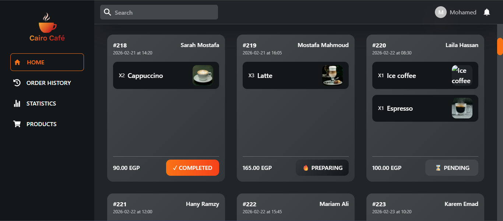
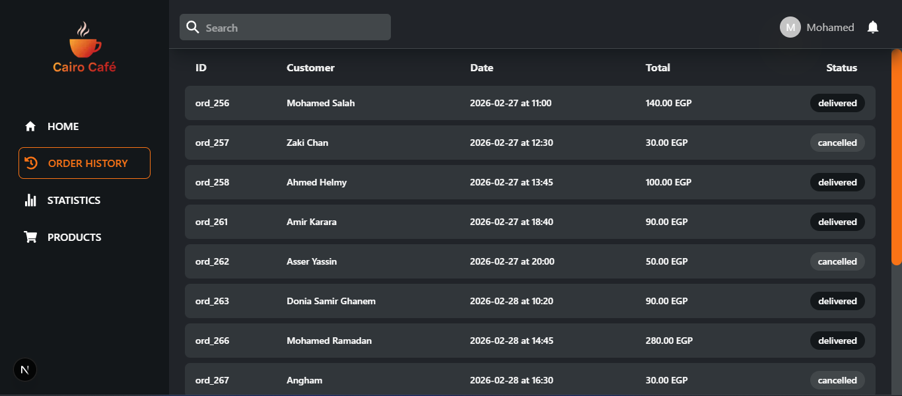
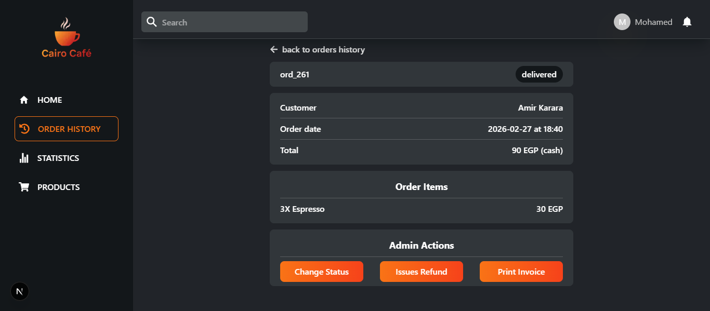
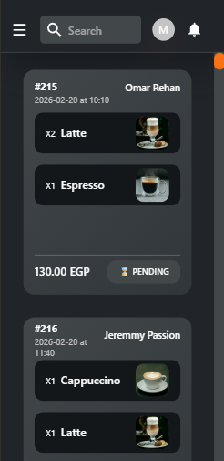
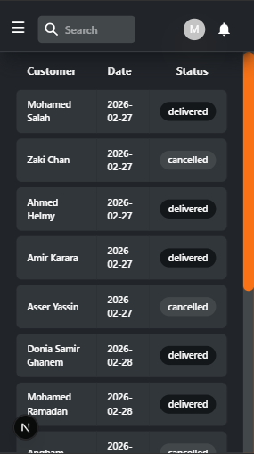
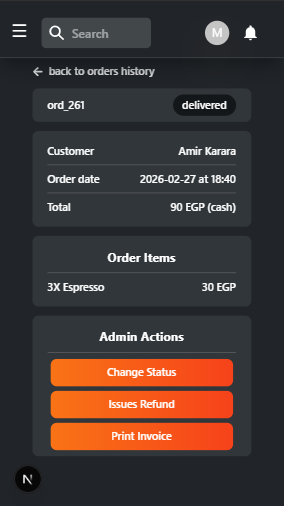
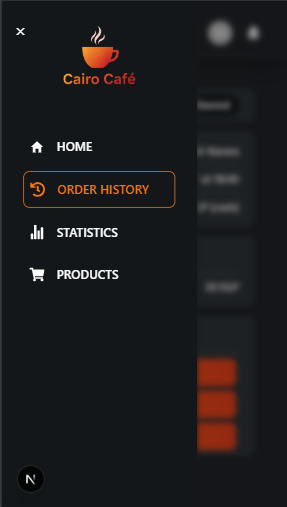

# Order Management Dashboard (OMD)

A responsive admin dashboard for managing and reviewing cafe orders, built with Next.js, TypeScript, and Tailwind CSS.
The project focuses on clean layout structure, reusable UI components, and a clear separation between interface logic and order-related domain logic.

---

## Live Demo

Add your deployed Vercel link here:

[Live Demo](https://omar-portfolio-3y3w.vercel.app/)

---

## Tech Stack

- Next.js
- React
- TypeScript
- Tailwind CSS

---

## Features

- Responsive dashboard layout for desktop and mobile screens
- Mobile drawer navigation with overlay and burger menu
- Orders overview page for active orders
- Order history page for finished orders
- Order details page with structured order information
- Shared orders state using React Context
- Order filtering helpers for active vs finished orders
- Order total calculated from line items instead of stored duplicated values
- Reusable utility helpers for dates, totals, and product lookup

---

## Project Structure Highlights

- `app/(dashboard)` contains the dashboard shell, pages, and shared layout structure
- `app/components` contains reusable UI components such as navbar, header, cards, table rows, and modals
- `app/lib` contains shared logic and helpers such as:
    - order context
    - order filters
    - date formatting
    - total calculation
    - product lookup
- `data` contains mock data used during UI and workflow development
- `types` contains TypeScript models for orders and products

---

## Screenshots

## Desktop:

## Mobile:

---

## Running Locally

1. Install dependencies:

`npm install`

2. Start the development server:

`npm run dev`

3. Open:

`http://localhost:3000`

---

## Production Checks

Before deployment, run:

- `npm run lint`
- `npm run build`

---

## Current Status

This project is actively being improved. The current version includes the main dashboard shell, mobile navigation behavior, orders flow, and shared logic utilities.
Planned improvements include search, sorting, filtering, pagination, products management, and backend integration.

---

## Author

Omar Rehan
Frontend Software Engineer

GitHub:
[OmarRehan777](https://github.com/OmarRehan777)
